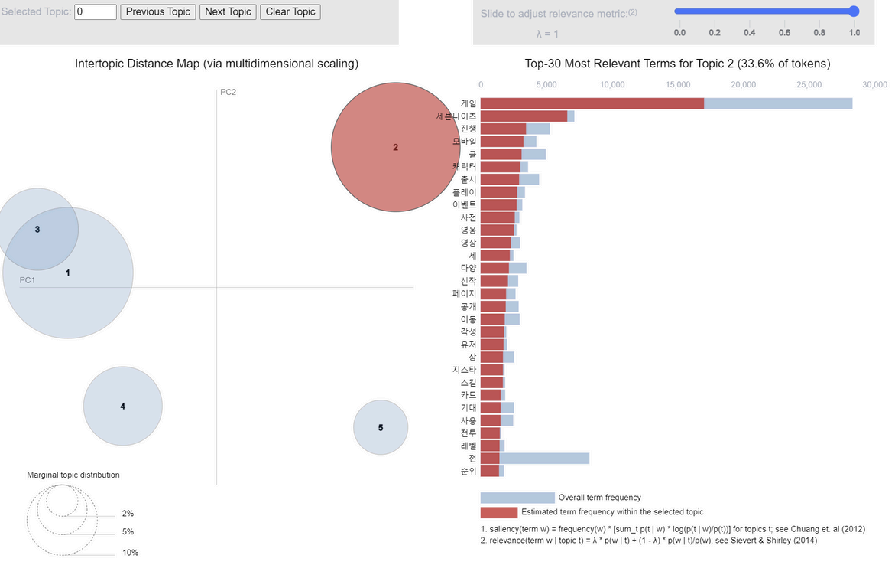

# 🎯 **텍스트 데이터 분석 팀 프로젝트**

## 🧑‍🤝‍🧑 **팀원**
- **구준회**
- **이재원**

## 📅 **시기**
- **2024년 1학기**

## 🕹️ **주제**
- **국내 주요 게임사에 대한 텍스트 데이터 분석**
  - **크래프톤, 넥슨, 넷마블, 엔씨소프트, 라이엇게임즈**

## 🎯 **목표**
- 각 게임사의 특징과 전략을 체계적으로 파악
- 각 기업의 사회적 가치와 게임 업계의 전체적인 트렌드 분석

---

## 🛠️ **1. 데이터 수집**

- **네이버 뉴스와 블로그 API 활용**
  - 신작 출시 정보와 주요 금융 데이터는 **뉴스**에서
  - 게임 리뷰와 채용, 복지 정보는 **블로그**에서 수집
- **검색어 예시**
  - `크래프톤`, `크래프톤 게임`, `크래프톤 주가`, `크래프톤 채용`, `크래프톤 복지`
- **Selenium 활용**하여 추가적인 본문 내용 수집

---

## 🧹 **2. 데이터 전처리**

- 데이터 통합과 라벨링
- 불필요한 단어 제거
- 결측치 처리
- 중복 링크 제거
- 데이터 정제 작업 진행

---

## 🔍 **3. 데이터 분석**

### 🌌 **1) 워드클라우드**
- 각 게임사별 주요 키워드 직관적 파악
- 제목을 중심으로 분석하여 정확도 유지
- 각 게임사별 워드클라우드 시각화 예정

### 🔮 **2) LDA, 토픽 모델링**
- 검색어별 토픽 차이 검증
- 회사별 새로운 인사이트 기대
- 제목과 본문을 모두 활용한 토픽 추출
- ex) 넷마블 LDA 시각화

 

### 📊 **3) 유사도 분석**
- 게임사별 전략과 특징 비교
- 중요 단어를 사용한 자카드, 코사인 유사도 분석
- 유사도 히트맵 시각화 예정

---

## 📝 **4. 분석 결과 및 결론**

- 분석을 통해 도출한 사회적 가치 설명
- 개선점 및 추후 연구 방향 제시

